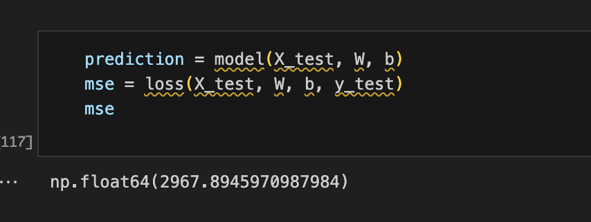
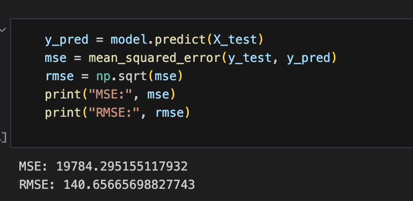
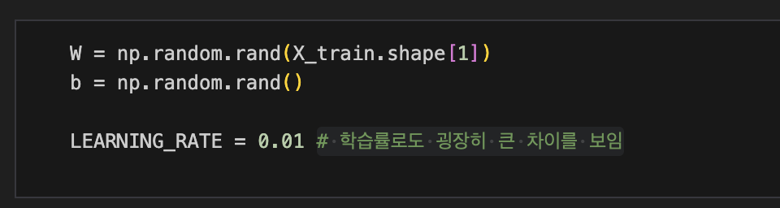
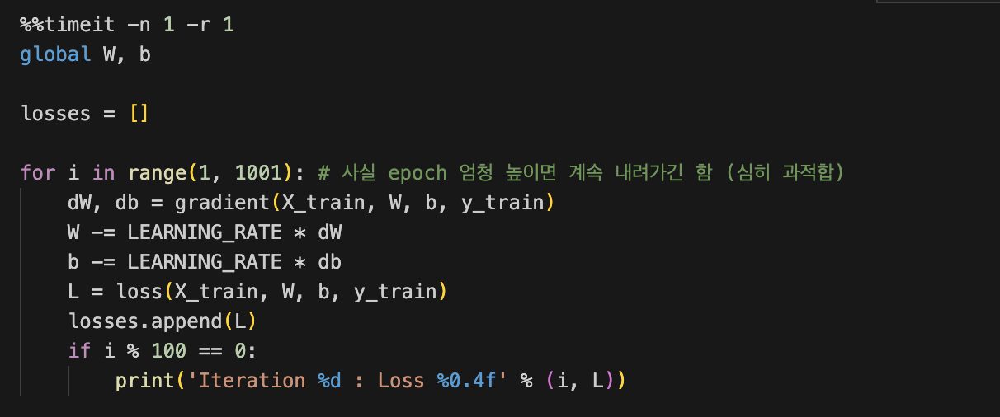

# AIFFEL Campus Online Code Peer Review Templete

- 코더 : 코더의 이름을 작성하세요.
- 리뷰어 : 리뷰어의 이름을 작성하세요.

# PRT(Peer Review Template)

- [ O ] **1. 주어진 문제를 해결하는 완성된 코드가 제출되었나요?**
  - 문제에서 요구하는 최종 결과물이 첨부되었는지 확인
    - 중요! 해당 조건을 만족하는 부분을 캡쳐해 근거로 첨부
      - Project 1 Result
        
        MSE 값 2967.8 달성 (<3000)

      - Project 2 Result
        
        RMSE 값 140.65 달성 (<150)

- [ O ] **2. 전체 코드에서 가장 핵심적이거나 가장 복잡하고 이해하기 어려운 부분에 작성된
      주석 또는 doc string을 보고 해당 코드가 잘 이해되었나요?** - 해당 코드 블럭을 왜 핵심적이라고 생각하는지 확인 - 해당 코드 블럭에 doc string/annotation이 달려 있는지 확인 - 해당 코드의 기능, 존재 이유, 작동 원리 등을 기술했는지 확인 - 주석을 보고 코드 이해가 잘 되었는지 확인 - 중요! 잘 작성되었다고 생각되는 부분을 캡쳐해 근거로 첨부

      - 필요 부분에 적절히 주석처리되어 있음 

    

    


- [ O ] **3. 에러가 난 부분을 디버깅하여 문제를 해결한 기록을 남겼거나
      새로운 시도 또는 추가 실험을 수행해봤나요?** - 문제 원인 및 해결 과정을 잘 기록하였는지 확인 - 프로젝트 평가 기준에 더해 추가적으로 수행한 나만의 시도,
      실험이 기록되어 있는지 확인 - 중요! 잘 작성되었다고 생각되는 부분을 캡쳐해 근거로 첨부

      - 실험 과정이 주석으로 남겨져 있습니다 "# 사실 epoch 엄청 높이면 계속 내려가긴 함 (심히 과적합)" 

- [ O ] **4. 회고를 잘 작성했나요?**
  - 주어진 문제를 해결하는 완성된 코드 내지 프로젝트 결과물에 대해
    배운점과 아쉬운점, 느낀점 등이 기록되어 있는지 확인
  - 전체 코드 실행 플로우를 그래프로 그려서 이해를 돕고 있는지 확인
    - 중요! 잘 작성되었다고 생각되는 부분을 캡쳐해 근거로 첨부

    - 이번 프로젝트에서는 적용되지 않는 부분이라고 생각됩니다.(회고 없음)

- [ O ] **5. 코드가 간결하고 효율적인가요?**
  - 파이썬 스타일 가이드 (PEP8) 를 준수하였는지 확인
  - 코드 중복을 최소화하고 범용적으로 사용할 수 있도록 함수화/모듈화했는지 확인
    - 중요! 잘 작성되었다고 생각되는 부분을 캡쳐해 근거로 첨부

    - 이번 프로젝트에서는 적용되지 않는 부분이라고 생각됩니다.(함수/모듈화 등 없음)

# 회고(참고 링크 및 코드 개선)

```
# 리뷰어의 회고를 작성합니다.
# 코드 리뷰 시 참고한 링크가 있다면 링크와 간략한 설명을 첨부합니다.
# 코드 리뷰를 통해 개선한 코드가 있다면 코드와 간략한 설명을 첨부합니다.
```
다른 분이 작업한 프로젝트를 검토하는 것이 인상적인 경험이었습니다.
epoch 수를 늘리는 경우에 성능 향상이 아니라 과적합이 발생할 수 있다는 사실을 알게 되었습니다. 
